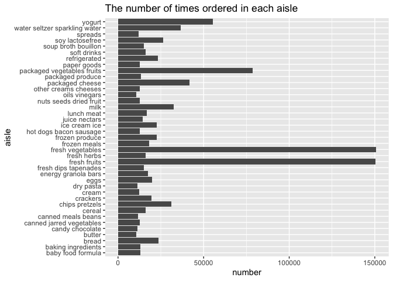
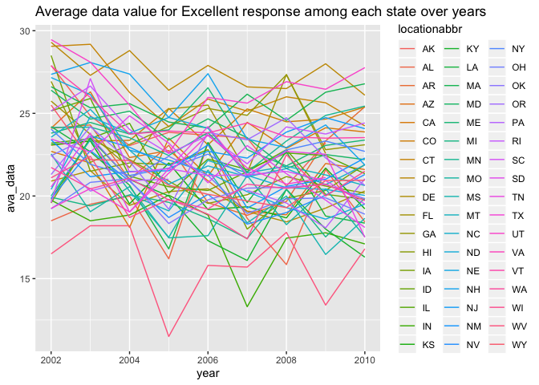

p8105\_hw3
================
Si Li

``` r
library(dplyr)
```

    ## 
    ## Attaching package: 'dplyr'

    ## The following objects are masked from 'package:stats':
    ## 
    ##     filter, lag

    ## The following objects are masked from 'package:base':
    ## 
    ##     intersect, setdiff, setequal, union

``` r
library(tidyverse)
```

    ## ── Attaching packages ─────────────────────────────────────────────────────────── tidyverse 1.2.1 ──

    ## ✔ ggplot2 3.2.1     ✔ readr   1.3.1
    ## ✔ tibble  2.1.3     ✔ purrr   0.3.2
    ## ✔ tidyr   1.0.0     ✔ stringr 1.4.0
    ## ✔ ggplot2 3.2.1     ✔ forcats 0.4.0

    ## ── Conflicts ────────────────────────────────────────────────────────────── tidyverse_conflicts() ──
    ## ✖ dplyr::filter() masks stats::filter()
    ## ✖ dplyr::lag()    masks stats::lag()

Problem 1

``` r
library(p8105.datasets)
data("instacart")
instacart %>% 
  summarise(n_aisle= n_distinct(aisle))
```

    ## # A tibble: 1 x 1
    ##   n_aisle
    ##     <int>
    ## 1     134

``` r
ais_n=
instacart %>% 
  count(aisle, name = "number")%>% 
  arrange(desc(number))

instacart %>% 
  count(aisle, name = "number")%>% 
  filter(number>10000)%>% 
  ggplot(aes(aisle, number, label=number))+
  geom_bar(stat="identity",position="dodge")+
  ggtitle("The number of times ordered in each aisle")+
  coord_flip()
```

<!-- -->

``` r
instacart %>%
  count(aisle, name = "n_times") %>% 
  filter(aisle %in% c("baking ingredients", "dog food care", "packaged vegetables fruits")) %>% 
  knitr::kable()
```

| aisle                      | n\_times |
| :------------------------- | -------: |
| baking ingredients         |    13088 |
| dog food care              |     1612 |
| packaged vegetables fruits |    78493 |

``` r
instacart %>% 
  group_by(product_name,order_dow) %>% 
  select(product_name, order_dow, order_hour_of_day) %>% 
  filter(product_name %in% c("Pink Lady Apples", "Coffee Ice Cream")) %>%
  summarise(mean_order_hour=mean(order_hour_of_day)) %>% 
  mutate(order_dow = recode(order_dow, `0` ="Sun", `1` = "Mon", `2`= "Tues", `3`= "Wed", `4` = "Thurs", `5`= "Fri", `6`= "Sat")) %>% 
  pivot_wider(names_from = order_dow,
              values_from = mean_order_hour)%>% 
  knitr::kable()
```

| product\_name    |      Sun |      Mon |     Tues |      Wed |    Thurs |      Fri |      Sat |
| :--------------- | -------: | -------: | -------: | -------: | -------: | -------: | -------: |
| Coffee Ice Cream | 13.77419 | 14.31579 | 15.38095 | 15.31818 | 15.21739 | 12.26316 | 13.83333 |
| Pink Lady Apples | 13.44118 | 11.36000 | 11.70213 | 14.25000 | 11.55172 | 12.78431 | 11.93750 |

The dataset have 1384617 rows and 15 columns. The number of aisles is
134, the aisle that the most items ordered from is fresh vegetables.
Some of the key variables are aisle, department.

The most items are ordered from two aisles, fresh vegetables and fresh
fruits, and the third one is packages vegetables fruits, meaning people
are living more healthy these days.

We can see from the table, among theses three aisles, packaged
vegetables fruits has the biggest number of ordering times, followed by
baking ingredients.

In Wednesday, Pink Lady Apples and Coffee Ice Cream have relatively the
highest mean hour of the day.

Problem 2

``` r
library(p8105.datasets)
data("brfss_smart2010")
brfss=
brfss_smart2010 %>% 
  janitor::clean_names() %>% 
  filter(topic %in% "Overall Health") %>% 
  mutate(
    response= forcats::fct_relevel(response, c("Poor", "Fair", "Good", "Very good", "Excellent"))
    )
brfss
```

    ## # A tibble: 10,625 x 23
    ##     year locationabbr locationdesc class topic question response
    ##    <int> <chr>        <chr>        <chr> <chr> <chr>    <fct>   
    ##  1  2010 AL           AL - Jeffer… Heal… Over… How is … Excelle…
    ##  2  2010 AL           AL - Jeffer… Heal… Over… How is … Very go…
    ##  3  2010 AL           AL - Jeffer… Heal… Over… How is … Good    
    ##  4  2010 AL           AL - Jeffer… Heal… Over… How is … Fair    
    ##  5  2010 AL           AL - Jeffer… Heal… Over… How is … Poor    
    ##  6  2010 AL           AL - Mobile… Heal… Over… How is … Excelle…
    ##  7  2010 AL           AL - Mobile… Heal… Over… How is … Very go…
    ##  8  2010 AL           AL - Mobile… Heal… Over… How is … Good    
    ##  9  2010 AL           AL - Mobile… Heal… Over… How is … Fair    
    ## 10  2010 AL           AL - Mobile… Heal… Over… How is … Poor    
    ## # … with 10,615 more rows, and 16 more variables: sample_size <int>,
    ## #   data_value <dbl>, confidence_limit_low <dbl>,
    ## #   confidence_limit_high <dbl>, display_order <int>,
    ## #   data_value_unit <chr>, data_value_type <chr>,
    ## #   data_value_footnote_symbol <chr>, data_value_footnote <chr>,
    ## #   data_source <chr>, class_id <chr>, topic_id <chr>, location_id <chr>,
    ## #   question_id <chr>, respid <chr>, geo_location <chr>

``` r
brfss%>% 
  filter(year=="2002") %>% 
  count(locationabbr, name="n_loc") %>% 
  mutate(n_loc= n_loc/5) %>%
  filter(n_loc>7)
```

    ## # A tibble: 3 x 2
    ##   locationabbr n_loc
    ##   <chr>        <dbl>
    ## 1 MA               8
    ## 2 NJ               8
    ## 3 PA              10

``` r
brfss %>% 
  filter(year=="2010") %>% 
  count(locationabbr, name="n_loc") %>% 
  mutate(n_loc= n_loc/5) %>%
  filter(n_loc>7)
```

    ## # A tibble: 11 x 2
    ##    locationabbr n_loc
    ##    <chr>        <dbl>
    ##  1 CA              12
    ##  2 FL              41
    ##  3 MA               9
    ##  4 MD              12
    ##  5 NC              12
    ##  6 NE              10
    ##  7 NJ              19
    ##  8 NY               9
    ##  9 OH               8
    ## 10 TX              16
    ## 11 WA              10

``` r
brfss %>% 
  filter(response=="Excellent") %>%
  group_by(year, locationabbr) %>% 
  summarise(ava_data=mean(data_value)) %>% 
  ggplot(aes(x=year, y=ava_data))+
  geom_line(aes(group= locationabbr, color=locationabbr))+  
  ggtitle("Average data value for Excellent response among each state over years")
```

    ## Warning: Removed 3 rows containing missing values (geom_path).

<!-- -->
